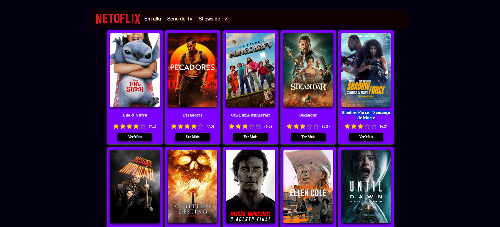
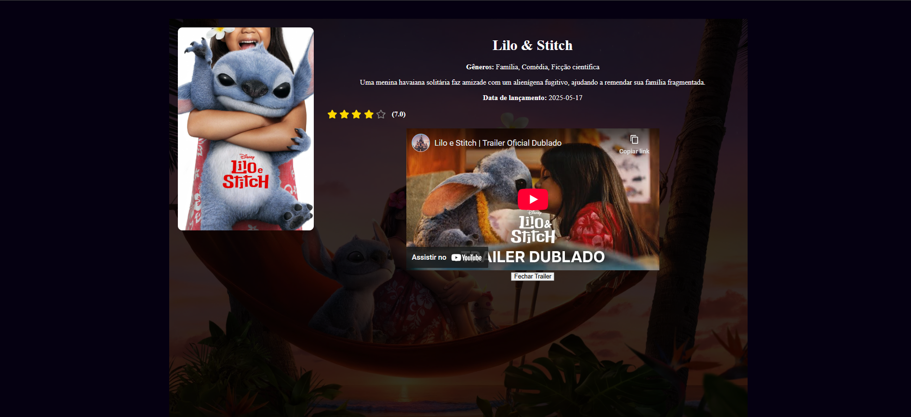

# NetoFlix - Projeto React de Filmes

---

## Descrição

NetoFlix é uma aplicação React que exibe detalhes de filmes usando a API do [The Movie Database (TMDb)](https://www.themoviedb.org/).  
Ela mostra:

- Lista de filmes com poster, título e avaliação em estrelas  
- Página de detalhes do filme com:
  - Imagem de fundo (backdrop)
  - Resumo
  - Gêneros
  - Data de lançamento
  - Avaliação com estrelas
  - Trailer do YouTube embutido  

---

## Tecnologias usadas

- React  
- React Router DOM  
- React Icons  
- TMDb API  
- CSS para estilização  

---

## Como usar

### Pré-requisitos

- Node.js e npm/yarn instalados  
- Conta e API key do [TMDb](https://www.themoviedb.org/settings/api)
